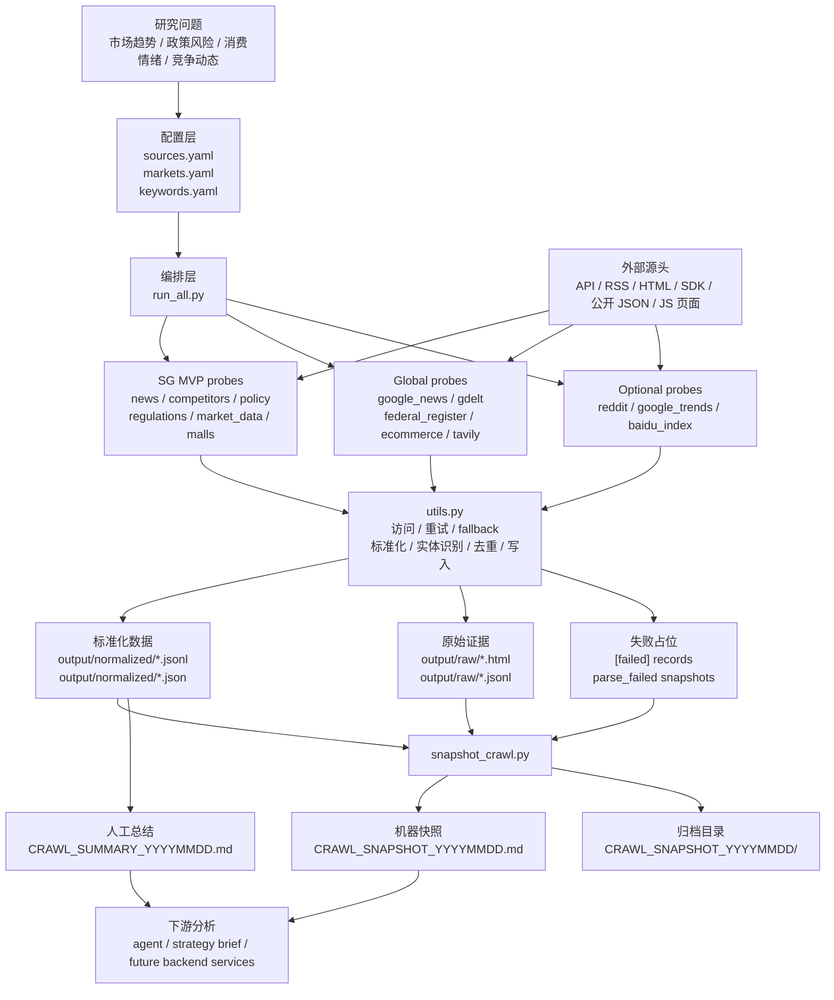

# data_probe 爬虫架构与原理

这份文档的目的不是列清单，而是帮你理解一个海外市场战略情报 Agent 的数据底座：品牌型企业在多个海外市场同时面对竞争、产品趋势、社媒声量、平台策略和法规变化，`data_probe` 负责把分散公开信息采集回来，整理成管理层和运营团队能快速使用的决策参考。

## 参考文件

本文主要依据这些本地文件写成：

| 文件 | 在本文中的作用 |
|---|---|
| [`CLAUDE.md`](CLAUDE.md) | 说明 data_probe 的定位、运行边界、已验证 probe、踩坑和数据质量 |
| [`README.md`](README.md) | 说明快速启动、运行方式、schema 和合规边界 |
| [`config/sources.yaml`](config/sources.yaml) | 定义数据源：哪些已跑、哪些只是登记待实现 |
| [`config/markets.yaml`](config/markets.yaml) | 定义目标市场和 Google News 参数 |
| [`config/keywords.yaml`](config/keywords.yaml) | 定义品牌、产品、平台、法规和市场主题关键词 |
| [`scripts/run_all.py`](scripts/run_all.py) | 定义爬虫如何被编排运行 |
| [`scripts/utils.py`](scripts/utils.py) | 定义 HTTP 获取、重试、fallback、标准化、去重和写入 |
| [`scripts/snapshot_crawl.py`](scripts/snapshot_crawl.py) | 定义如何把 JSONL 结果汇总成可读快照 |
| [`output/CRAWL_SNAPSHOT_20260523.md`](output/CRAWL_SNAPSHOT_20260523.md) | 记录 2026-05-23 实际跑出来的数据数量、失败数和市场覆盖 |
| [`output/CRAWL_SUMMARY_20260523.md`](output/CRAWL_SUMMARY_20260523.md) | 记录人工整理后的战略总结、质量判断和后续建议 |

下面每个关键判断会用“依据：...”标明来自哪些文件。

## 先从第一性原理理解爬虫

爬虫不是“把网页下载下来”。真正的爬虫系统是在回答一个研究问题：外部世界发生了什么，哪些信号值得进入我们的分析系统？

一个完整爬虫链路可以拆成 6 个问题：

1. 我要研究什么问题？
2. 哪些外部源头能产生相关信号？
3. 这些源头能不能被合法、稳定地访问？
4. 拿到的数据是什么形态：API、RSS、HTML、JS 页面、登录态页面，还是第三方 SDK？
5. 如何把不同形态的数据变成统一记录？
6. 如何判断这条记录的可信度、适用范围和缺陷？

`data_probe` 做的就是这 6 件事。它不是生产数据库，也不是后端服务，而是数据源验证和情报采集层。通过验证的逻辑，未来才迁移到 `backend/services/`。依据：`CLAUDE.md`、`README.md`。

可以把它类比成企业的“市场雷达信息漏斗”：

- 最上游是各种原始信息：新闻、公告、法规、价格、论坛讨论、搜索趋势。
- 中间层是采集和清洗：访问、解析、失败处理、去重、标准化。
- 下游是分析判断：机会、风险、需关注事项、后续行动建议。

爬虫的价值不在于“抓得多”，而在于把混乱的外部信号变成可追踪、可比较、可复盘的证据。

## data_probe 的整体架构图



这个图的核心因果链是：

`研究问题 -> 数据源选择 -> 访问方式 -> 解析质量 -> 标准化记录 -> 可分析证据`

只要其中一环弱，最后的分析也会弱。例如 Google News 覆盖很广，但很多只是标题和跳转链接；Federal Register 覆盖窄，但证据质量高；百度指数源头存在，但真实指数需要 JS/登录态，所以现在只能作为受限占位。依据：`CLAUDE.md`、`sources.yaml`、`CRAWL_SNAPSHOT_20260523.md`、`CRAWL_SUMMARY_20260523.md`。

## data_probe 现在到底爬了什么

截至 2026-05-23，最终 JSONL 快照有 8 个 source，共 1,488 条记录，其中 22 条是 failed placeholders。依据：`CRAWL_SNAPSHOT_20260523.md`。

| source_id | 类型 | 记录数 | 主要源头 | 当前意义 |
|---|---:|---:|---|---|
| `google_news_rss` | news | 654 | Google News RSS | 广覆盖市场新闻雷达 |
| `reddit` | social | 383 | Reddit 公开 JSON / PRAW 优先 | 英语区消费者讨论和情绪 |
| `tavily` | news | 146 | Tavily Search API | 带摘要的搜索增强新闻 |
| `federal_register` | regulation | 135 | US Federal Register API | 美国官方法规风险信号 |
| `gdelt_doc` | news | 120 | GDELT 2.0 DOC API | 全球新闻事件流，部分受限流影响 |
| `google_trends` | trend | 45 | pytrends / Google Trends | 9 市场搜索热度对照 |
| `ecommerce_announcements` | ecommerce | 4 | Shopify / Amazon / Shopee / Lazada | 平台政策源验证，质量仍弱 |
| `baidu_index` | trend | 1 | 百度指数页面 | 已探测但未取得真实指数曲线 |

注意一个关键点：“有 source_id”不等于“高质量可分析”。例如 `baidu_index` 已经有结构化占位记录，但它不是百度指数 time series；它的价值是告诉我们：这个源头已确认存在，但当前纯 HTTP 方式拿不到真实曲线。依据：`probe_baidu_index.py`、`CRAWL_SNAPSHOT_20260523.md`、`CRAWL_SUMMARY_20260523.md`。

## 一条数据是怎么被爬出来的

以 Google News 为例：

1. `markets.yaml` 给出市场参数，例如 JP 的 `hl=ja`、`gl=JP`、`ceid=JP:ja`。
2. `keywords.yaml` 给出主题，例如 `jewelry market`、`luxury consumption`、`gold price`。
3. `sources.yaml` 里的 `global_news.url_template` 把市场和关键词拼成 RSS URL。
4. `probe_global_news.py` 抓取 RSS 条目。
5. `utils.make_intelligence_record()` 把标题、链接、发布时间、市场、来源等字段统一成 JSONL。
6. `utils.detect_entities()` 用关键词粗略识别品牌和产品。
7. `utils.save_jsonl()` 写到 `output/normalized/google_news_rss_YYYYMMDD.jsonl`。
8. `snapshot_crawl.py` 汇总进 `CRAWL_SNAPSHOT_YYYYMMDD.md`。

依据：`markets.yaml`、`keywords.yaml`、`sources.yaml`、`utils.py`、`snapshot_crawl.py`。

这套流程正好对应赛题里的“海外市场战略情报 Agent”。例如企业 X 想看“日本市场高端珠宝消费是否升温、竞争对手有没有新动作、平台政策是否影响投放”，就可以把市场设为 JP，把关键词设为 `luxury jewelry`、`gold jewelry`、`Cartier`、`Chow Tai Fook`、`consumer sentiment`，再从新闻、搜索趋势、社媒和平台公告里汇总信号。结构不变，只是市场、关键词和输出框架换成企业战略简报。

## 源头类型决定爬虫质量

不同数据源不是平等的。它们的访问方式决定了稳定性、证据强度和分析用途。

| 源头类型 | 例子 | 优点 | 缺点 | 企业战略情报用途 |
|---|---|---|---|---|
| 官方 API | Federal Register | 结构清楚、可信度高、可追溯 | 覆盖范围窄，更新节奏慢 | 法规、关税、合规风险判断 |
| RSS | Google News RSS | 覆盖快，适合扫描 | 常只有标题和跳转链接 | 跨市场新闻雷达 |
| 搜索 API | Tavily | 带摘要，召回更强 | 依赖配额和第三方服务 | 快速补充新闻正文和行业事件 |
| 公开 JSON | Reddit fallback | 不需 OAuth 也能验证社媒信号 | 限流和字段受限 | 消费者讨论、抱怨、偏好和口碑 |
| SDK / 非官方库 | pytrends | 快速拿趋势 demo | 易限流，非官方稳定性有限 | 搜索热度和需求关注度代理 |
| HTML 页面 | Lazada / 百度指数 shell | 能确认页面存在 | JS/登录态时拿不到真实数据 | 平台公告、政策页面、趋势产品探测 |
| registry-only | TikTok、Instagram、小红书等 | 先登记未来路线 | 当前无可运行数据 | 未来社媒声量和内容趋势扩展池 |

结论：越接近官方披露和结构化 API，越适合做“硬判断”，例如法规和平台规则；越接近社媒和搜索趋势，越适合做“早期信号”，例如消费者兴趣、潜在爆品和舆情变化。依据：`sources.yaml`、`CLAUDE.md`、`CRAWL_SUMMARY_20260523.md`。

## 标准化为什么重要

外部源头格式差异很大：新闻有标题和媒体源，法规有机构和摘要，Reddit 有 score 和评论数，趋势数据有时间序列，电商公告可能只有 HTML。没有统一 schema，下游就无法比较。

`data_probe` 的 global/optional JSONL 统一成 18 个字段，包括：

- `source_type`
- `source_id`
- `market`
- `language`
- `title`
- `url`
- `published_at`
- `collected_at`
- `author_or_account`
- `raw_text`
- `summary`
- `keywords`
- `entities`
- `signal_type`
- `impact_direction`
- `evidence_level`
- `confidence`

依据：`README.md`、`utils.py`。

这和企业管理报表里的统一指标口径很像。你可能从新闻、平台公告、社媒、趋势工具和官方法规里拿到完全不同的数据，但最后都要变成可排序、可过滤、可追溯的统一记录。否则数据越多，噪音越大。

## 关键隐藏逻辑

### 1. 关键词是早期的“研究假设”

`keywords.yaml` 不是简单词库，它代表当前研究假设：哪些品牌、产品、平台、法规词值得关注。爬虫会围绕这些词去召回数据，也会用这些词做粗实体识别。依据：`keywords.yaml`、`utils.py`。

企业场景迁移：如果研究新品类，就把关键词换成产品词和竞品词；如果研究渠道政策，就加入平台、佣金、禁售、广告规则；如果研究消费情绪，就加入 `consumer sentiment`、`review`、`trend`、`Reddit`、`TikTok Shop` 等主题。

### 2. 市场参数是近似，不是绝对归属

Google News 的 `hl/gl/ceid` 可以让搜索偏向某个国家或语言，但不保证每条新闻只属于该市场。依据：`markets.yaml`、`CRAWL_SNAPSHOT_20260523.md`。

企业场景迁移：用 `US` 参数搜到的新闻不一定只影响美国业务；用 `JP` 参数搜到的新闻也可能是全球品牌在日本媒体里的报道。市场标签是分析入口，不是最终结论。

### 3. failed placeholder 是一种信息

失败占位不是垃圾。它告诉你某个源头“目前不能稳定生产化”的原因。例如百度指数需要 JS/登录态，Lazada 是 JS 渲染，Shopee 超时，Shopify atom feed 不是真的 feed。依据：`CLAUDE.md`、`CRAWL_SNAPSHOT_20260523.md`、`CRAWL_SUMMARY_20260523.md`。

企业场景迁移：如果一个平台公告页、社媒趋势页、竞品页面需要登录或反爬严重，也要记录失败原因。这样团队知道下一步是申请 API、采购数据，还是设计合规浏览器采集方案。

### 4. evidence_level 和 confidence 不是一回事

`evidence_level` 描述证据来源类型，例如 official、media、social、third_party_report。`confidence` 是 MVP 阶段的排序强度，不等于事实为真的概率。依据：`utils.py`、`CLAUDE.md`。

企业场景迁移：官方平台公告 evidence 高，但业务影响不一定大；Reddit 或 TikTok 讨论 evidence 低，但可能先于新闻暴露消费者兴趣和抱怨。

## 共识、差异和缺口，换一种更实用的说法

与其说“共识、矛盾和缺失”，不如把资料对照成三个问题：哪些已经稳定？哪些只是验证中？哪些还没真正接入？

### 已经比较稳定的部分

- `google_news_rss`：覆盖广，9 市场全覆盖，适合新闻雷达。
- `federal_register`：官方 API，质量最高，适合 US 法规风险。
- `reddit`：公开 JSON fallback 已跑通，适合英语区消费者声量。
- `google_trends`：pytrends 已跑通，适合方向性搜索热度对照。

依据：`CLAUDE.md`、`CRAWL_SNAPSHOT_20260523.md`、`CRAWL_SUMMARY_20260523.md`。

### 已经接入但要谨慎使用的部分

- `gdelt_doc`：能拿真实媒体 URL，但当前环境有 SSL EOF 和 429 限流。
- `tavily`：摘要质量好，但依赖 API key、配额和缓存。
- `ecommerce_announcements`：部分平台登录、JS 或反爬，当前质量弱。
- `baidu_index`：已探测，但不是可用指数曲线。

依据：`CLAUDE.md`、`sources.yaml`、`CRAWL_SNAPSHOT_20260523.md`。

### 只是登记，还没有稳定落盘的部分

TikTok Creative Center、TikTok Research API、Instagram、X、SerpAPI Trends、DataForSEO、本地法规源、World Bank、IMF、OECD、UN Comtrade 等很多源都在 `registry_only`，但登记不等于已实现。依据：`sources.yaml`、`CRAWL_SUMMARY_20260523.md`。

企业战略情报里，这个区分特别重要：watchlist 不是 dataset。把一个源登记进目录，只说明它值得未来接入，不说明它已经能支持管理层判断。

## 用企业 X 的海外市场战略情报场景重新理解这套架构

赛题里的企业 X 是一个覆盖多个海外市场的品牌型企业。它不接入内部销售、库存、CRM 或广告投放数据，只依赖公开信息，目标是让 AI Agent 扮演“市场雷达”：每天主动发现外部变化，归纳成管理层和运营团队能快速使用的战略简报。

在这个场景里，`data_probe` 对应的是 Agent 的“外部情报采集底座”：

| 企业 X 需要回答的问题 | data_probe 对应能力 | 主要数据源 |
|---|---|---|
| 哪些市场今天有值得关注的新变化？ | 按 market 聚合新闻和搜索结果 | `google_news_rss`、`gdelt_doc`、`tavily` |
| 竞争对手或品牌动态有没有变化？ | 关键词命中品牌、竞品、产品实体 | `keywords.yaml`、`google_news_rss`、`tavily`、SG competitor probes |
| 产品趋势是否升温？ | 产品词和趋势词召回 + 搜索热度对照 | `google_trends`、`baidu_index` 占位、新闻源 |
| 社交媒体上消费者在讨论什么？ | 社媒声量和讨论文本采集 | `reddit`，未来可扩展 TikTok / Instagram / 小红书 |
| 销售平台策略是否调整？ | 平台公告和政策页采集 | `ecommerce_announcements`，未来扩展 Seller Center / 官方 API |
| 法规和合规要求是否变化？ | 官方法规源和监管公告采集 | `federal_register`，未来扩展 JP/KR/SEA 本地法规源 |
| 管理层如何快速使用？ | 统一 schema + snapshot + summary | `output/normalized/*.jsonl`、`CRAWL_SNAPSHOT`、`CRAWL_SUMMARY` |

这套架构的关键价值是“不依赖即时内部数据”。它不回答“昨天实际卖了多少”，而回答“外部环境发生了什么，哪些变化可能影响未来运营”。这正好适合每日战略简报：先看外部信号，再由运营、商品、市场、合规团队结合内部数据判断行动。依据：`README.md`、`CLAUDE.md`、`CRAWL_SUMMARY_20260523.md`。

### 每日战略简报可以如何生成

一个适合企业 X 的日常流程可以是：

1. 早上定时跑 `run_all.py --only-global --include reddit,trends,baidu`，获取新闻、法规、社媒和趋势数据。
2. 跑 `snapshot_crawl.py`，得到当天各 source、market、signal_type 的机器快照。
3. Agent 读取标准化 JSONL，把记录按市场和信号类型分组。
4. 对每个市场输出 3 到 5 条关键变化，按 `competition`、`product_trend`、`social_buzz`、`platform_policy`、`regulation` 分类。
5. 对每条变化标注潜在影响：机会、风险、需关注事项。
6. 给出建议观察重点，例如“继续追踪 TikTok Shop 政策变化”“复核 US AML/CFT 相关法规”“关注 JP 搜索热度是否连续三天上升”。
7. 保留来源 URL、source_id、evidence_level 和 confidence，方便人工追溯。

依据：`run_all.py`、`snapshot_crawl.py`、`utils.py`、`CRAWL_SNAPSHOT_20260523.md`。

### 从数据到管理判断，中间要经过三层

第一层是事实层：某条新闻、公告、帖子、趋势记录真实存在。`url`、`published_at`、`source_name`、raw snapshot 负责支撑这一层。

第二层是信号层：这条事实属于竞争、产品趋势、社媒声量、平台政策、法规还是宏观变化。`signal_type` 和 `entities` 负责支撑这一层。

第三层是判断层：这条信号对企业 X 是机会、风险，还是只需关注。`impact_direction` 现在多为 `watch`，后续可以由 Agent 或人工规则进一步判断。

这三层不能混在一起。比如 Reddit 上某个抱怨帖是事实，但它是否代表整体市场风险，需要结合声量、重复出现次数、平台、地区和业务重要性判断。依据：`utils.py`、`CRAWL_SUMMARY_20260523.md`。

### 一个示例输出框架

```text
每日海外市场战略简报

1. 市场关键变化
   - US：Federal Register 出现贵金属 / AML 相关法规信号
   - JP：Tavily 与 Google News 显示高端珠宝内容增多
   - GLOBAL：Reddit 中 engagement ring 讨论保持活跃

2. 潜在业务影响
   - 机会：JP 高端珠宝内容热度可用于内容和选品观察
   - 风险：US 合规信号需要法务 / 合规团队复核
   - 需关注：Reddit 讨论代表英语区早期消费者情绪，不等同销售数据

3. 建议后续行动
   - 对 US official/regulation 记录做人工复核
   - 对 JP 相关新闻跑正文抽取，确认是否真与目标品类相关
   - 继续追踪 Reddit 高 confidence 帖子的主题变化

4. 来源追溯
   - 每条要点附 source_id、url、evidence_level、confidence
```

依据：`CRAWL_SNAPSHOT_20260523.md`、`CRAWL_SUMMARY_20260523.md`。

## 判断一个新爬虫源是否值得接入

以后无论接入新闻、平台公告、社媒、趋势工具还是行业报告，都可以用这张表判断：

| 问题 | 好答案 | 坏信号 |
|---|---|---|
| 这个源回答什么研究问题？ | 能对应明确决策，例如法规风险、需求变化、情绪变化 | 只是“可能有用” |
| 是否有稳定访问方式？ | 官方 API / RSS / 可静态解析 HTML | JS 登录态、强反爬、无授权 |
| 字段是否结构化？ | 有 title、time、source、summary、url | 只有截图或杂乱 HTML |
| 是否能追溯？ | 有原始 URL 和 raw snapshot | 来源不明 |
| 能否标准化？ | 可以填入 18 字段 schema | 字段缺失太多 |
| 失败是否可解释？ | 能写 failed placeholder 和原因 | 静默失败 |
| 对业务判断的证据等级？ | official > media > trend/social | 把低证据源当硬结论 |

依据：`README.md`、`CLAUDE.md`、`utils.py`、`CRAWL_SNAPSHOT_20260523.md`。

## 当前最应该改进什么

1. 把标题级新闻升级为正文级新闻：Google News 现在覆盖很广，但需要真实 URL 和正文提取增强可分析性。
2. 修复电商平台公告源：Shopify、Amazon、Shopee、Lazada 质量不稳定。
3. 补 JP/KR/SEA 官方法规源：现在只有 US Federal Register 达到高质量官方法规层。
4. 解决中文趋势和内容平台：百度指数、抖音指数、小红书、TikTok 需要授权、官方 API、合规浏览器采集或第三方数据服务。
5. 做跨日去重和历史趋势：现在 JSONL 是 append-only，更像每日快照，还不是长期时间序列数据库。

依据：`CLAUDE.md`、`CRAWL_SUMMARY_20260523.md`、`utils.py`。

## 快速命令

```bash
cd data_probe

# 原 SG MVP probes
python scripts/run_all.py

# SG + global probes
python scripts/run_all.py --global

# 只跑 global probes，并加 Reddit / Google Trends / 百度指数探测
python scripts/run_all.py --only-global --include reddit,trends,baidu

# 汇总当天 JSONL，生成机器快照和归档目录
python scripts/snapshot_crawl.py
```

依据：`run_all.py`、`snapshot_crawl.py`、`README.md`、`CLAUDE.md`。
